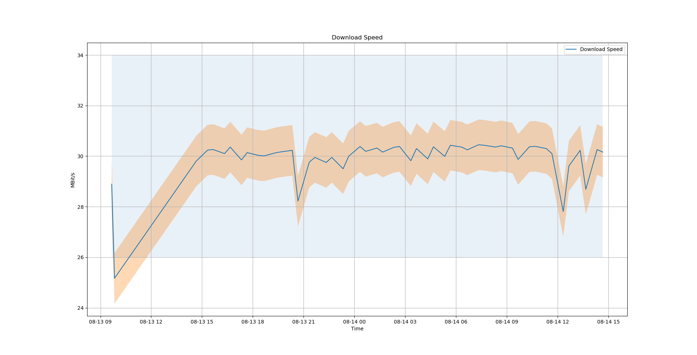
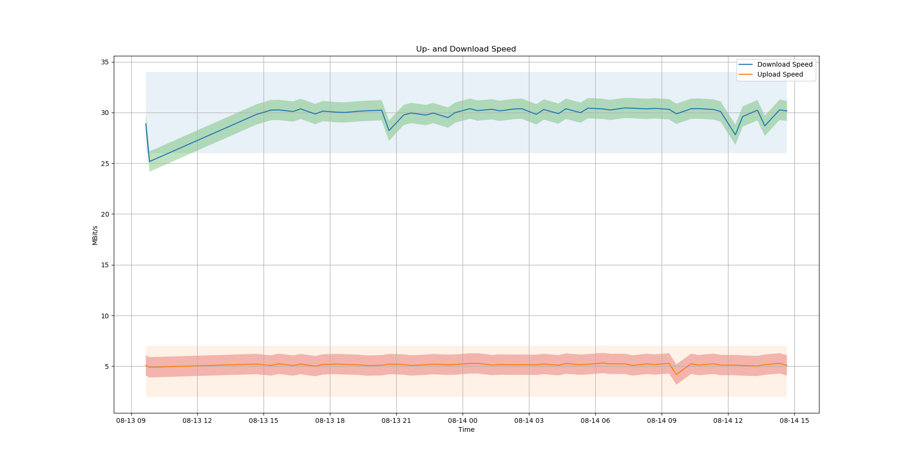
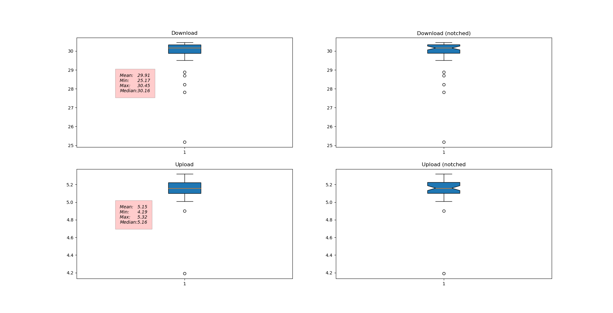

# Speedpi

This is a tiny speedtest tool for Raspberry Pi using Ookla's speedtest API.

## Requirements
A Raspberry Pi with internet access or another Linux machine. 

## Installation

`git clone https://github.com/hitbear/speedpi.git` in the home directore /home/pi of your Raspberry Pi.

`pip3 install -r requirements.txt`

Check out with `which speedtest-cli` where your speedtest file lies. If it is not `/usr/local/bin`, change the path in `src/speedpi.py`. 

## Running

On a terminal type

`chmod +x start.sh`

and 

`./start.sh`

The Script starts a bunch of speedtests and writes the results into a CSV file. At first - if no csv file exists - the script will create one.

## Evaluation

To get nice plots type

`python3 src/evaluate.py`

## Notes

The time is UTC time. To doublecheck type `date -u` into a terminal. 
To check crontab jobs type `crontab -l` into a terminal. To delete all jobs type `crontab -r`

Observing the csv file could be done by `tail -f speedtest.csv`

## ToDo

Sometimes on Raspberry Pi the path for speedtest is /usr/bin and sometimes /usr/local/bin